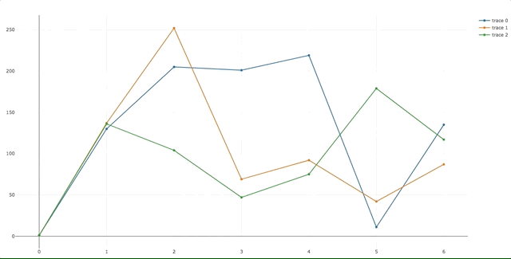

Plotly Live Plot
========================

Live plot from any input (serial port, file, ...) using [Plotly](https://plot.ly) graph library and node :chart_with_upwards_trend:.

Useful tool to debug IoT devices sensors.  :smiley:

*PR are welcome* :smirk:



## Requirement

- nvm (recommended)
- node v.6

## Setup
```sh
$ git clone https://github.com/alexisduque/plotly-live-plot.git && cd plotly-live-plot
$ nvm install v6
$ nvm use v6
$ npm install
```

## Usage

```sh
$ DATA_SOURCE | node .
````

And open `http://localhost:8080`

### Example with Pyserial

```sh
$ miniterm.py /dev/ttyUSB0 9600 | node .
```

### Test Mode

Plot random data for tests

``$ NODE_ENV=test node .``

### Change it to match your needs

1. In [index.js, l.15](https://github.com/alexisduque/plotly-live-plot/blob/master/index.js#L15)
1. In [public/index.html, l.11,29](https://github.com/alexisduque/plotly-live-plot/blob/master/public/index.html#L29) (see [Plotly JS doc.](https://plot.ly/javascript/line-charts/))
